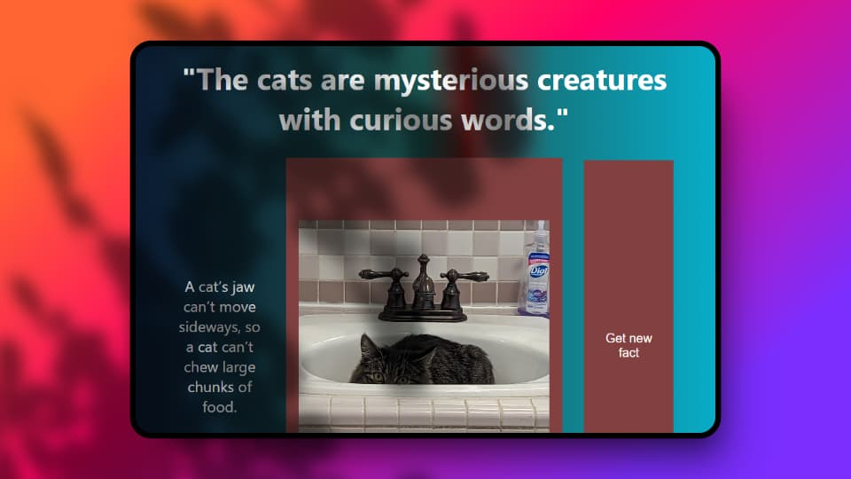

# Generador de Hechos Aleatorios de Gatos

Esta aplicación te permite generar un hecho aleatorio sobre gatos y mostrar una imagen de un gato junto con el hecho. Está construida con [React](https://reactjs.org/) y utiliza una API para obtener imágenes de gatos y hechos aleatorios.

## Características

- **Generar Hecho Aleatorio**: Obtén un hecho interesante sobre gatos con solo hacer clic en un botón.
- **Mostrar Imagen de Gato**: Visualiza una imagen de un gato que se muestra junto con el hecho aleatorio.
- **Interfaz Intuitiva**: Una interfaz simple y fácil de usar para interactuar con la aplicación.

## Instalación

1. **Clona el Repositorio**

   ```bash
  gh repo clone GersonGarciaKatowhu/gatosRandom
```
2. **Instala las dependencias**
```bash
npm i
```
3. **Corre los documentos**

```bash
npm run dev
```

